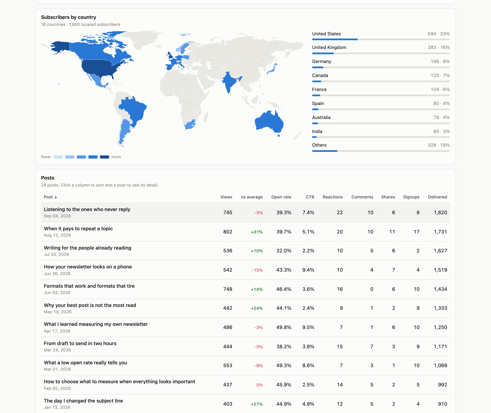
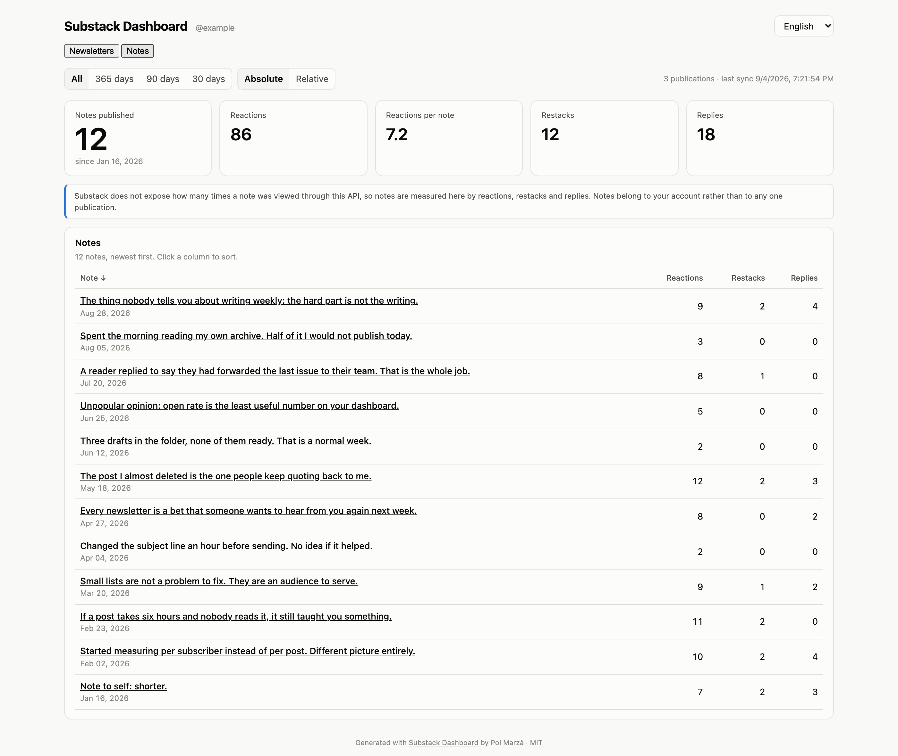
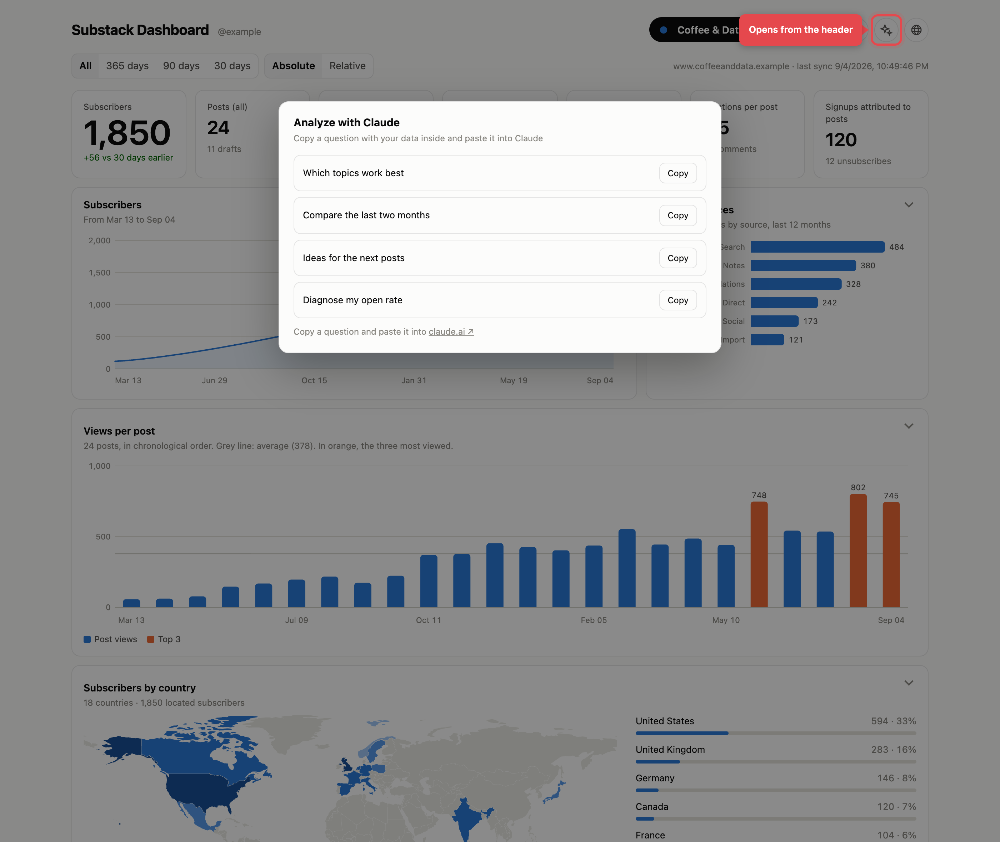

# Panel de Substack

Panel local de estadísticas para **tus propias** publicaciones de Substack: vistas, aperturas, tasa de apertura, clics, reacciones, comentarios, altas atribuidas, fuentes de tráfico, detalle por post y una comparativa entre todas tus publicaciones.

Substack no tiene API pública. Su panel de escritor habla con una API privada en `/api/v1/…` que funciona con la sesión de tu navegador. Este proyecto lee esa API **con tu propia sesión**, guarda los datos en local y genera un HTML autocontenido. No se envía nada a ningún sitio.

*[Read me in English](README.md)*


## Qué aspecto tiene

Las capturas usan **datos ficticios** generados con `npm run demo` y salen en inglés, como el resto del repositorio. No aparece ninguna publicación real. El recuadro rojo es una anotación de esta documentación, no forma parte de la interfaz.

**Comparativa entre publicaciones, cifras absolutas.** La lista más grande gana en casi todo y el top 10 global lo copa una sola publicación:


**Los mismos datos, normalizados por audiencia.** Al dividir el alcance entre los suscriptores que recibieron cada envío, y la interacción entre las vistas del propio post, cambia el retrato: una lista pequeña y fiel puede rendir más que una grande:


**Una publicación en detalle**, con el crecimiento de suscriptores, las fuentes de captación y las vistas por post:


**Cualquier post**, desplegado bajo su fila, con sus fuentes de tráfico, los enlaces más clicados y las vistas diarias de la primera semana:


**De dónde son tus suscriptores**, en un mapamundi sombreado por país y con las cifras exactas al lado:



**Las notas**, la otra mitad de Substack, medidas por reacciones, restacks y respuestas:



**Preguntas que vale la pena hacerse**, cada una se copia junto con los números que estás mirando, lista para pegar en Claude:



### Métricas absolutas y relativas

Las cifras en bruto favorecen a los posts recientes: uno publicado a 1.800 suscriptores superará a otro publicado a 200, aunque el antiguo llegara a una porción mucho mayor de su audiencia. Triplicar los "me gusta" después de triplicar la lista no es una mejora.

El modo **Relativas** normaliza:

| Métrica | Denominador | Para qué |
|---|---|---|
| Vistas por 100 suscriptores | suscriptores que recibieron el envío | alcance sin depender del tamaño de la lista |
| Reacciones y comentarios por 100 vistas | vistas del propio post | interacción sin depender del alcance |
| Altas por 1.000 vistas | vistas del propio post | conversión sin depender del tráfico |

La tasa de apertura y el CTR ya son proporciones, así que no cambian.

Hay una trampa que el panel resuelve de forma explícita: un denominador diminuto dispara cualquier proporción (un post enviado a 25 personas que se hace viral en la web marca 1.500 vistas por 100 suscriptores). Por eso las clasificaciones dejan fuera lo que no llega a 30 de denominador, mientras que las tablas siguen mostrando el valor junto al número por el que se dividió, para que puedas juzgarlo tú.

---

## Tres formas de usarlo

Elige una. Las tres producen el mismo panel.

| | Ideal si | Necesitas |
|---|---|---|
| **1. [Extensión de Chrome](https://chromewebstore.google.com/detail/nojlkggahlaaankemcnjdigdkogcnepn)** | Instalar, pulsar y ya está | Chrome |
| **2. Skill de Claude Code** | Que Claude además te lea los números | Claude Code |
| **3. App local** | Quedarte con los datos crudos en archivos | Node 22+ |

---

### 1. Extensión de Chrome (lo más simple)

Todo vive dentro de la extensión: recoge tus estadísticas con la sesión de
Substack que ya tienes en tu Chrome, las guarda en el almacenamiento del propio
navegador y enseña el panel como una página suya. Sin servidor, sin Node y sin
volver a iniciar sesión.

**[Instálala desde la Chrome Web Store](https://chromewebstore.google.com/detail/nojlkggahlaaankemcnjdigdkogcnepn)**, donde está publicada como
*Panel para Substack*. Luego pulsa su icono, **Sync all publications** y
**Open the dashboard**.

Si prefieres ejecutarla desde este repositorio (para leer antes el código, o para
cambiarlo): abre `chrome://extensions`, activa el **modo de desarrollador**, pulsa
**Cargar descomprimida** y elige la carpeta `extension/`.

Abre una pestaña en segundo plano en cada una de tus publicaciones, ejecuta allí
el mismo recolector de solo lectura y guarda el resultado en `chrome.storage`, en
tu ordenador. No habla con nada más, y la cookie de sesión no sale del navegador.
(Funciona así —inyectando en una pestaña real en vez de pedir los datos desde el
service worker— porque la cookie de sesión de Substack no viaja de forma fiable
desde el contexto de fondo de una extensión.)

Cada sincronización además acumula histórico, así que la línea de suscriptores
crece más allá de los 30 días que devuelve la propia API de Substack.

### 2. Skill de Claude Code

Instala la skill y pide tus estadísticas. Claude abre un navegador, tú inicias
sesión en Substack, y Claude descarga todo y construye el panel.

```bash
cp -R substack-dashboard ~/.claude/skills/
```

Luego basta con pedirlo: *«enséñame cómo van mis posts de Substack»*.

La skill es autocontenida (`SKILL.md`, un recolector para el navegador, un
generador en Python sin dependencias y una referencia de endpoints). No necesita
servidor, ni Playwright, ni extensión. Ver [`substack-dashboard/SKILL.md`](substack-dashboard/SKILL.md).

### 3. App local

Para cuando quieres el JSON crudo en disco: un servidor Node pequeño que sirve el
panel y guarda un histórico en SQLite.

```bash
npm install
npm start          # http://127.0.0.1:8787/
```

Recoger los datos es un paso aparte: `npm run sync` usa Playwright y necesita
`npm run login` antes, y `npm run import <carpeta>` toma los JSON que descarga el
recolector de la skill. Después, `npm run build` regenera `dashboard.html`.

¿Quieres verlo antes de conectar nada? `npm run demo` construye un panel con
datos ficticios.

Para arrancar el servidor al iniciar sesión (macOS): `npm run install-service`
(se deshace con `npm run uninstall-service`).

> **Sobre el inicio de sesión.** Playwright usa un perfil de Chrome aparte, así
> que hay que volver a entrar allí. Si el código por correo de Substack no llega,
> usa *«Iniciar sesión con contraseña»* en esa pantalla — o usa la opción 1, que
> reutiliza la sesión que ya tienes.

---

## Qué muestra el panel

**Los paneles se pliegan.** Cada gráfico tiene un chevrón; pliega los que no necesites y la elección se recuerda en ese navegador, así que sobrevive a las sincronizaciones.

**Buscador.** La lupa (o `/`, o `Cmd+K`) abre una paleta que busca posts en todas tus publicaciones. Al elegir uno salta a su publicación y despliega su detalle.

**Navegación.** El panel abre en tu publicación principal, la que el propio Substack marca como tal. Si tienes más de una, un contador `+N` junto a su nombre abre un menú con las demás, más **Comparar todas** y **Notas**. Con una sola publicación ese contador no aparece.

**Vista Comparativa** — tabla ordenable de todas las publicaciones (suscriptores, variación a 30 días, posts, vistas, vistas por post, apertura, CTR, reacciones por post, comentarios, altas), gráficos de barras con un color fijo por publicación y un top 10 global de posts.

**Pestaña por publicación** — tarjetas de cabecera, la serie de suscriptores, fuentes de crecimiento, vistas por post en el tiempo, un mapamundi de suscriptores por país y una tabla ordenable con una columna *vs media* que compara cada post con el promedio de posts comparables que calcula el propio Substack. Al pinchar un post se despliega ahí mismo, justo bajo su fila, con sus fuentes de tráfico, enlaces más clicados, vistas diarias de la primera semana y (con la app local) cómo se movieron sus números entre sincronizaciones.

**Vista Notas** — las notas de Substack medidas por reacciones, restacks y respuestas. Substack no expone por esta vía cuántas veces se ha visto una nota, así que ese dato no aparece en lugar de estimarse.

**Analizar con Claude** — el icono de destellos de la cabecera abre una capa con preguntas que vale la pena hacerse sobre lo que estás mirando («qué temas funcionan mejor», «compara el último mes con el anterior», «dónde concentrar el esfuerzo»). Al copiar una, se lleva la pregunta *y* los números que tienes delante, listos para pegar en Claude. No se envía nada a ningún sitio: copiar es todo el mecanismo.

El filtro de rango (todo / 365 / 90 / 30 días) recalcula todas las métricas de posts.

**Idioma.** La interfaz está en inglés por defecto, con un selector arriba a la derecha para pasar a español. La elección se recuerda en ese navegador, y `?lang=es` o `?lang=en` fuerza una. Los números, las fechas y los porcentajes siguen la misma elección. Tus propios títulos nunca se traducen: aparecen tal como los publicaste.

---

## Datos y privacidad

- Todo se queda en tu máquina: la extensión guarda sus datos en el almacenamiento que Chrome le reserva, y la app local guarda los JSON en `data/`, el histórico en `data/substack.sqlite` y un `dashboard.html` autocontenido.
- La extensión no tiene servidor, ni cuenta, ni analítica. Al desinstalarla se borran sus datos, así que exporta o sincroniza antes si te importa el histórico.
- `data/`, `.profile/` y `dashboard.html` están en el `.gitignore`: contienen tus estadísticas y tu sesión.
- **Tu sesión vale tanto como tu contraseña.** Permite publicar y borrar, no solo leer. Este proyecto solo lee. No compartas `.profile/` ni pegues tu cookie en ningún sitio.
- Solo devuelven estadísticas las publicaciones donde eres **administrador**.

## Requisitos

- **Skill**: Claude Code y Python 3.
- **App local**: Node 22+ (usa el `node:sqlite` incorporado). Playwright controla el Chrome que ya tienes instalado; no descarga otro navegador.
- **Extensión**: Chrome (o cualquier navegador Chromium que admita extensiones MV3).

## Estructura

```
substack-dashboard/     la skill portable de Claude Code (SKILL.md, recolector, generador, endpoints)
tools/                  la plantilla del panel y sus generadores (servidor, Playwright, capa SQLite)
extension/              la extensión de Chrome: recolector, almacenamiento y su propio panel
demo/                   datos ficticios para previsualizar (fuera de git)
docs/                   capturas usadas en este README
data/                   tus datos e histórico (fuera de git)
```

### Publicar la extensión

`npm run package` escribe `store/dashboard-for-substack-<versión>.zip` a partir de
una lista explícita de archivos, para que no se cuele nada en la subida, y
`npm run store-shots` genera las capturas de 1280×800 que pide la Chrome Web
Store. Todo lo que hace falta para la ficha —descripciones, propósito único, una
justificación por permiso— está en [`store/listing.md`](store/listing.md), y la
política de privacidad a la que apunta es [`PRIVACY.md`](PRIVACY.md).

`tools/template.html` es la única fuente del panel: `npm run templates` regenera
desde ahí la copia de la skill y la página de la extensión. Ejecútalo después de
tocar la plantilla — la página de la extensión no puede llevar scripts en línea,
así que el generador la parte en `dashboard.html` + `dashboard.js`.

## Créditos

Los contornos de los países proceden de [Natural Earth](https://www.naturalearthdata.com/) (escala 1:110m, dominio público), convertidos a trazados SVG e incrustados en el panel por `tools/make_worldmap.py` para que el mapa funcione sin conexión.

## Avisos

Esto usa una API **no documentada**. Substack puede cambiarla sin previo aviso y los endpoints pueden dejar de funcionar. Tómalo como una herramienta de trabajo, no como un producto con soporte. Las peticiones van a menos de 1 por segundo para no forzar los límites.

Documentación de endpoints: [`substack-dashboard/references/endpoints.md`](substack-dashboard/references/endpoints.md). Referencia de la comunidad: [substack-api-reference](https://github.com/AnthonyDavidAdams/substack-api-reference).

## Atribución

Publicado bajo licencia MIT, que ya obliga a que el aviso de copyright acompañe a cualquier copia o parte sustancial del software. Dicho en claro: úsalo, bifúrcalo y construye sobre él con libertad, pero mantén el crédito a **Pol Marzà** y, cuando tenga sentido, enlaza a este repositorio. Cada panel que genera la herramienta lleva una línea discreta de crédito al pie; te agradezco que la dejes.

## Licencia

MIT — ver [LICENSE](LICENSE).
