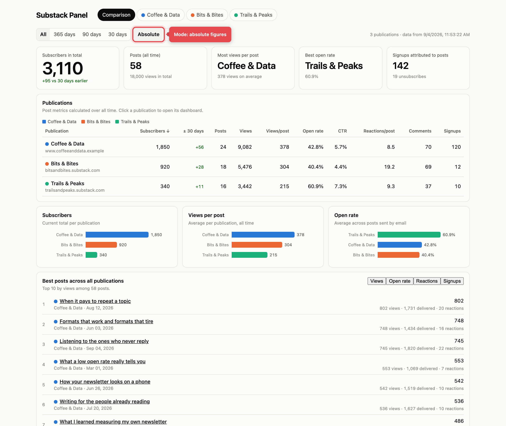
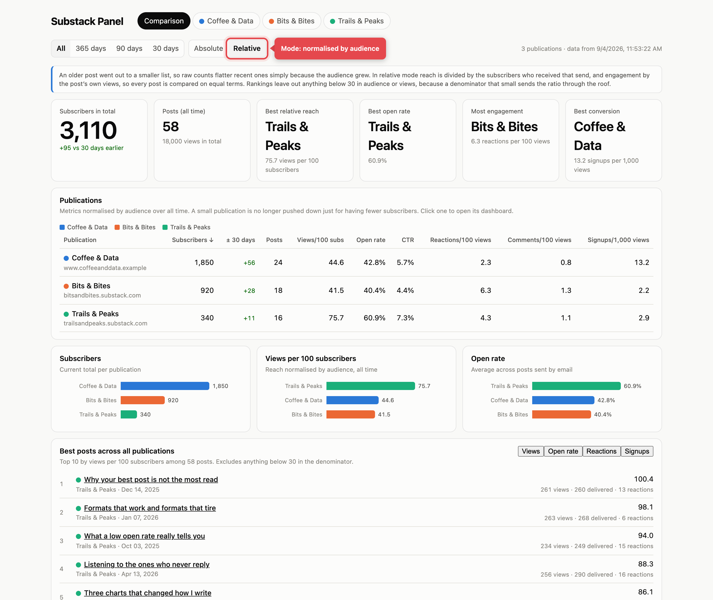
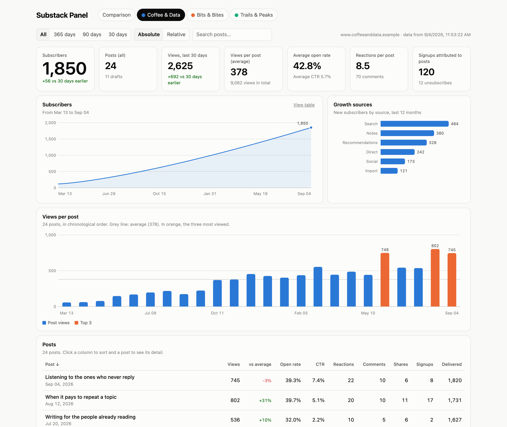
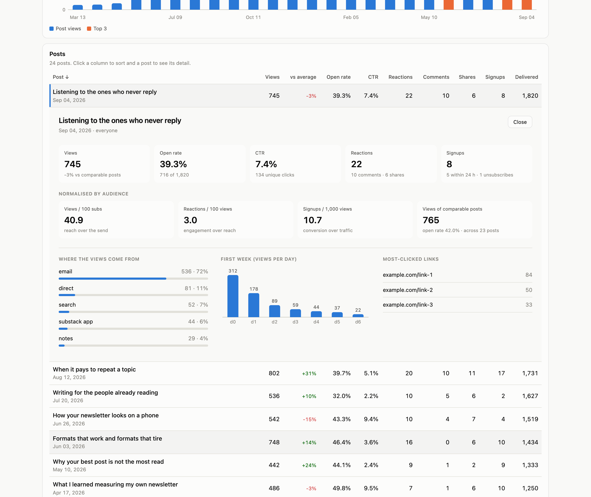

# Substack Dashboard

A local analytics dashboard for **your own** Substack publications: views, opens, open rate, clicks, reactions, comments, attributed signups, traffic sources, per-post detail, and a side-by-side comparison across all your publications.

Substack has no public API. Its writer dashboard talks to a private JSON API under `/api/v1/…` that works with your logged-in browser session. This project reads that API **with your own session**, saves the data locally, and builds a self-contained HTML dashboard. Nothing is sent anywhere.

*[Léeme en español](README.es.md)*


## What it looks like

The screenshots below use **fictitious data** generated by `npm run demo` — no real publication is shown. The red marker is an annotation added for this documentation; it is not part of the interface.

**Comparison across publications, absolute numbers.** The biggest list wins almost everything, and the global top 10 is filled by a single publication:



**The same data, normalised by audience.** Divide reach by the subscribers who actually received each send, and engagement by the post's own views, and a different picture appears — a small, loyal list can outperform a large one:



**One publication in detail**, with subscriber growth, acquisition sources and views per post:



**Any post**, expanded in place under its row, with its traffic sources, most-clicked links and first-week daily views:



### Absolute vs relative metrics

Raw counts flatter recent posts: a post published to 1,800 subscribers will beat one published to 200, even if the older one reached a far larger share of its audience. Tripling your likes after tripling your list is not an improvement.

Switching to **Relativas** normalises everything:

| Metric | Denominator | Why |
|---|---|---|
| Views per 100 subscribers | subscribers who received that send | reach independent of list size |
| Reactions / comments per 100 views | the post's own views | engagement independent of reach |
| Signups per 1,000 views | the post's own views | conversion independent of traffic |

Open rate and click-through rate are already ratios, so they don't change.

One caveat handled explicitly: a tiny denominator inflates any ratio (a post emailed to 25 people that went viral on the web scores 1,500 views per 100 subscribers). Rankings therefore skip anything below 30 in the denominator, while tables still show the value next to the number it was divided by, so you can judge for yourself.

---

## Three ways to use it

Pick one. They all produce the same dashboard.

| | Best for | What you need |
|---|---|---|
| **1. Claude Code skill** | Just want the dashboard, no setup | Claude Code |
| **2. Local app** | Recurring use, history over time | Node 22+ |
| **3. Chrome extension** | Local app, but signing in via Playwright fails | Node 22+ and Chrome |

---

### 1. Claude Code skill (simplest)

Install the skill and ask for your stats. Claude opens a browser, you log into Substack, and Claude fetches everything and builds the dashboard for you.

```bash
cp -R substack-dashboard ~/.claude/skills/
```

Then just ask: *"show me how my Substack posts are performing"*.

The skill is self-contained (`SKILL.md`, a browser collector, a dependency-free Python builder, and an endpoint reference). It needs no server, no Playwright, and no extension. See [`substack-dashboard/SKILL.md`](substack-dashboard/SKILL.md).

### 2. Local app

A small Node server that hosts the dashboard, stores a history in SQLite, and gives you a **Sync** button.

```bash
npm install
npm start          # http://127.0.0.1:8787/
```

From the dashboard:

1. **Sign in to Substack** — opens a Chrome window; log in once. The profile is saved in `.profile/`.
2. **Sync** — downloads every publication, saves a new snapshot, and rebuilds the dashboard.

Want to see it before connecting anything? `npm run demo` builds a dashboard from fictitious data.

Terminal equivalents: `npm run login`, `npm run sync` (or `npm run sync -- my-newsletter` for one), `npm run build`, `npm run import`.

To start it automatically on login (macOS): `npm run install-service` (undo with `npm run uninstall-service`).

> **Note on signing in.** Playwright drives a separate Chrome profile, so you have to log in again there. If Substack's email code doesn't arrive, use *"Sign in with password"* on that screen — or use option 3, which reuses the session you already have.

### 3. Chrome extension

Uses the Substack session already in your normal Chrome, so there is no second login.

1. Open `chrome://extensions`, enable **Developer mode**, click **Load unpacked**.
2. Select the `extension/` folder.
3. With `npm start` running, click the extension icon and **Sync all publications**.

It only talks to `*.substack.com` (read-only) and your own `127.0.0.1:8787`. The cookie never leaves your browser.

---

## What the dashboard shows

**Comparison tab** — a sortable table of every publication (subscribers, 30-day change, posts, views, views/post, open rate, CTR, reactions/post, comments, signups), bar charts with a fixed color per publication, and a global top-10 of posts across all of them.

**Per-publication tab** — headline tiles, the subscriber line, growth sources, views-per-post over time, and a sortable post table with a *vs average* column comparing each post to Substack's own benchmark of comparable posts. Click any post and it expands in place, right under its row, showing its traffic sources, most-clicked links, first-week daily views, and (with the local app) how its numbers moved between syncs.

A range filter (all / 365 / 90 / 30 days) recomputes every post metric.

**Language.** The dashboard follows the browser it is opened in: Spanish when the browser is set to Spanish, English otherwise. Append `?lang=es` or `?lang=en` to the URL to force one. Numbers, dates and percentages follow the same choice.

---

## Data and privacy

- Everything stays on your machine: JSON snapshots in `data/`, history in `data/substack.sqlite`, and a self-contained `dashboard.html`.
- `data/`, `.profile/` and `dashboard.html` are gitignored — they hold your stats and your session.
- **Your session is as powerful as your password.** It can publish and delete, not just read. This project only ever reads. Don't share `.profile/` and don't paste your cookie anywhere.
- Only publications where you are an **admin** return stats.

## Requirements

- **Skill**: Claude Code + Python 3.
- **Local app**: Node 22+ (uses the built-in `node:sqlite`). Playwright drives your installed Chrome; no separate browser download.

## Layout

```
substack-dashboard/     the portable Claude Code skill (SKILL.md, collector, builder, endpoint docs)
tools/                  local app: server, Playwright sync, SQLite layer, dashboard builder
extension/              optional Chrome extension (syncs using your normal session)
demo/                   fictitious data for previewing (gitignored)
docs/                   screenshots used in this README
data/                   your snapshots + SQLite history (gitignored)
```

## Caveats

This uses an **undocumented** API. Substack can change it without notice, and endpoints may break. Treat this as a working tool, not a supported product. Requests are paced under ~1/second to stay well within limits.

Endpoint documentation: [`substack-dashboard/references/endpoints.md`](substack-dashboard/references/endpoints.md). Community reference: [substack-api-reference](https://github.com/AnthonyDavidAdams/substack-api-reference).

## Attribution

Released under MIT, which already requires the copyright notice to travel with any copy or substantial portion of the software. In plain terms: use it, fork it and build on it freely, but keep the credit to **Pol Marzà** and, where it makes sense, link back to this repository. Every dashboard the tool generates carries a discreet credit line in its footer; please leave it in place.

## License

MIT — see [LICENSE](LICENSE).
